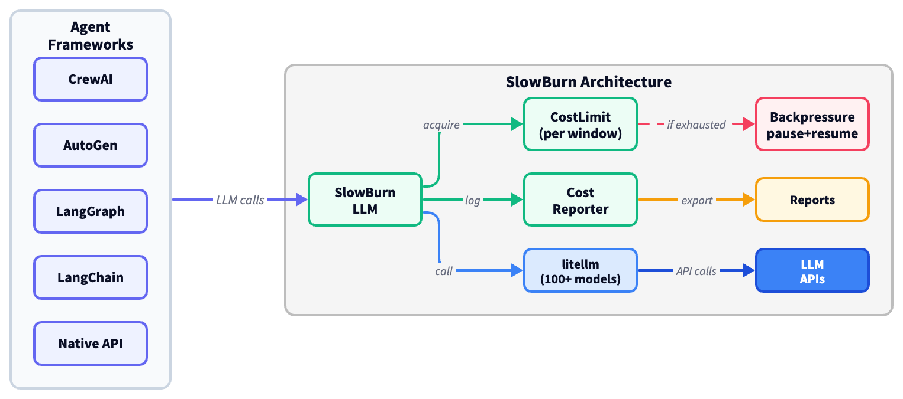

# 🐢🔥 SlowBurn: Cost-Sustainable Concurrent Execution for Long-Horizon LLM Agents

[](https://pypi.org/project/slowburn/)
[](https://www.python.org/downloads/)
[](https://opensource.org/licenses/MIT)

---

<p align="center">
  <a href="https://drive.google.com/drive/folders/1_CWYaP9WP-p0X0_RVAJv1rrX-KNF2C1w?usp=drive_link">
    
  </a>
</p>

<p align="center">
  <a href="https://drive.google.com/drive/folders/1_CWYaP9WP-p0X0_RVAJv1rrX-KNF2C1w?usp=drive_link">
    <picture>
      
    </picture>
  </a>
  <br/>
  <sub><b>Click the image above to watch the demo video</b></sub>
</p>

---

## Overview

Long-horizon LLM agents (autonomous coding assistants, deep research pipelines, multi-agent simulations) issue dozens to hundreds of API calls per task. Existing tools either passively monitor spending, or hard-terminate the agent when a budget cap is reached, discarding accumulated context.

SlowBurn takes a different approach: **when the budget is exhausted, the agent pauses rather than crashes.** Budget exhaustion becomes a flow-control signal (backpressure), not a fatal error. The agent sleeps until the rate-limit window refills, then resumes exactly where it left off with no context loss.

**What SlowBurn provides:**

- **CostLimit**: a dollar-denominated rate limit that composes with token and request rate limits, and blocks rather than terminates when exhausted
- **SlowBurnLLM**: an asyncio LLM worker with automatic per-call cost tracking, multi-turn conversations, tool calling, and 100+ models via [litellm](https://github.com/BerriAI/litellm) (text and vision)
- **Framework integrations**: drop-in hooks for [CrewAI](https://github.com/crewAIInc/crewAI), [AutoGen (AG2)](https://github.com/ag2ai/ag2), [LangGraph](https://github.com/langchain-ai/langgraph), and [LangChain](https://github.com/langchain-ai/langchain) that share a unified budget
- **CostReporter**: per-call, per-model cost attribution with JSON, Markdown, and LaTeX export
- **Global config**: all defaults centralized in `slowburn_config`, overridable at runtime via `temp_config()`

## Quick Start

Create a cost-controlled LLM worker with a daily dollar budget, make calls, and inspect the cost report:

```python
from slowburn import create_llm

# Create a cost-controlled LLM worker: $5 daily budget, asyncio execution
llm = create_llm(model="gpt-4o-mini", budget_usd=5.0, window="daily")

# Make LLM calls (concurrent on the asyncio event loop)
result = llm.call_llm(prompt="Summarize this paper...").result()

# Check costs
reporter = llm.get_reporter().result()
print(f"Cost: ${reporter.total_cost():.4f}")
print(reporter.to_markdown())

llm.stop()
```

### Vision-Language Agents

Pass local files, URLs, or data-URLs as images for multimodal (VLM) calls:

```python
from pathlib import Path

result = llm.call_llm(
    prompt="Describe this image in detail.",
    images=[Path("photo.jpg")],       # local files, URLs, or data-URLs
    image_detail="high",
).result()
```

### Batch calls (concurrent)

Send multiple prompts in one call; they execute concurrently on the asyncio event loop under the same budget:

```python
results = llm.call_llm_batch(
    prompts=["Capital of France?", "Capital of Japan?", "Capital of Brazil?"],
).result()
# All 3 execute concurrently on the event loop
```

### Multi-turn conversations

Pass `history=` to maintain conversation state across turns. When `history` is provided, `call_llm` returns the full messages list (with the assistant response appended) instead of a plain string. The messages list is the conversation state; you control it, and pass it back on the next call.

**In a loop (the common pattern):**

```python
llm = create_llm(model="gpt-4o-mini", budget_usd=1.0)

tasks = [
    "My name is Zephyr. I'm researching fusion energy.",
    "What are the main approaches to achieving net energy gain?",
    "Which approach is closest to commercialization?",
]

messages = []  # empty list enables multi-turn mode from the first call
for task in tasks:
    messages = llm.call_llm(
        task,
        system_prompt="You are a helpful research assistant.",
        history=messages,
    ).result()
    print(f"User:      {task}")
    print(f"Assistant: {messages[-1]['content']}\n")

llm.stop()
```

`system_prompt` is only prepended on the first call (when history has no system message yet). On subsequent calls it's a no-op, so passing it every time is safe.

**With `build_messages` (for processing inputs before the LLM call):**

`build_messages` constructs the messages list without calling the LLM. Pass its output directly to `call_llm` via `prompt=` (when `prompt` is a list of dicts, `call_llm` sends it as-is and returns a messages list):

```python
messages = []
for task in tasks:
    # Build the messages list (sync, no LLM call)
    input_messages = llm.build_messages(
        prompt=task,
        system_prompt="You are a helpful assistant.",
        history=messages,
    ).result()

    # Log/inspect before sending
    print(f"Sending {len(input_messages)} messages, last 3:")
    for message in input_messages[-3:]:
        role = message["role"]
        content = str(message.get("content", ""))[:80]
        print(f"  {role}: {content}")
    save_to_disk(input_messages)

    # Send the pre-built messages to the LLM (no re-building)
    messages = llm.call_llm(prompt=input_messages).result()
```

**Return type auto-detection:** `history=` provided or `prompt` is a list of message dicts returns a messages list; a plain string prompt with no history returns a string (backward compatible). Override explicitly with `return_messages=True` or `return_messages=False`. 

### Tool calling (ReAct agents)

`create_llm` accepts `tools` and `tool_choice` as first-class parameters. Combined with `history=`, this enables the standard tool-calling loop. The inner `while` loop handles tool execution; the outer loop drives multiple tasks:

```python
llm = create_llm(
    model="gpt-4o-mini",
    budget_usd=1.0,
    tools=[{
        "type": "function",
        "function": {
            "name": "search_web",
            "description": "Search the web for information.",
            "parameters": {
                "type": "object",
                "properties": {"query": {"type": "string"}},
                "required": ["query"],
            },
        },
    }],
    tool_choice="auto",
)

tasks = ["Population of Tokyo?", "GDP of Germany?"]
messages = []

for task in tasks:
    # Send the user's task
    messages = llm.call_llm(
        prompt=task,
        system_prompt="Use tools to find real data.",
        history=messages,
    ).result()

    # Tool-calling loop: execute tools until the LLM produces a text response
    while messages[-1].get("tool_calls"):
        for tc in messages[-1]["tool_calls"]:
            result = my_tool_executor(tc["function"]["name"], tc["function"]["arguments"])
            messages.append({
                "role": "tool",
                "tool_call_id": tc["id"],
                "content": result,
            })
        # Re-submit with tool results (empty prompt = no new user message)
        messages = llm.call_llm(prompt="", history=messages).result()

    print(f"Q: {task}")
    print(f"A: {messages[-1]['content']}\n")

llm.stop()
```

### Structured output with validators

Attach a validator function to parse and type-check the response; `ValueError` triggers an automatic retry:

```python
import re

def extract_number(text: str) -> int:
    match = re.search(r"\d+", text)
    if match is None:
        raise ValueError(f"No number found: {text!r}")  # triggers retry
    return int(match.group())

answer = llm.call_llm(
    prompt="What is 17 * 3? Reply with just the number.",
    validator=extract_number,    # retries automatically on ValueError
).result()
# answer = 51 (int, not str)
```

### Global configuration

Override defaults (temperature, budget, timeouts) for a specific run using a context manager that restores on exit:

```python
from slowburn import slowburn_config, temp_config

# Inspect defaults
print(slowburn_config.defaults.temperature)    # 0.7
print(slowburn_config.defaults.budget_usd)     # inf

# Override for a specific run (restores on exit)
with temp_config(temperature=0.0, budget_usd=0.10):
    llm = create_llm(model="gpt-4o-mini")
    # temperature=0.0, budget_usd=$0.10
```

### Multi-endpoint routing (multiple keys, accounts, or providers)

`create_llm` accepts an `endpoints=[...]` list to route a single logical worker across multiple logical "endpoints" (which could be different API keys, accounts, regions, or even providers). The worker holds an internal pool, picks one endpoint per call (round-robin by default), and enforces a separate set of limits *per endpoint*. Concurrent calls fan out across endpoints automatically.

Each endpoint dict can carry its own `model`, `api_key`, `api_base`, and a per-endpoint `limits=` block. Bookkeeping fields (anything else you put in the dict, e.g. `account_id`, `region`) are preserved on the resolved config object — they don't reach the LLM call but are visible to a custom `endpoint_resolver` if you set one (see "Custom endpoint resolvers" below).

**Example: Using 3 OpenAI keys, and setting 5-hour and 1-week call limits, 5-hour spend cap, concurrency cap per endpoint.**

OpenAI rate limits are per-key, not per-account. By giving each key its own endpoint with its own limit set, SlowBurn enforces all four constraints independently and routes around any key that's currently saturated.

```python
from concurry import RateLimit, RateLimitAlgorithm
from slowburn import CostLimit, create_llm

WINDOW_5H = 5 * 3600    # 5 hours in seconds
WINDOW_1W = 7 * 86400   # 1 week in seconds

def endpoint_with_limits(*, name, api_key, max_calls_5h, max_calls_1w, budget_5h_usd, max_concurrent):
    return {
        "endpoint_id": name,                       # label for cost reports
        "api_key": api_key,                        # this key only on this endpoint
        # Per-endpoint limits replace the global cascade for any slot they set.
        "limits": dict(
            # Two RateLimits on the same slot -> both windows enforced.
            requests=[
                RateLimit(key="requests", capacity=max_calls_5h,
                          window=WINDOW_5H, algorithm=RateLimitAlgorithm.GCRA),
                RateLimit(key="requests", capacity=max_calls_1w,
                          window=WINDOW_1W, algorithm=RateLimitAlgorithm.GCRA),
            ],
            # Dollar budget reset every 5 hours.
            budget=[
                CostLimit(budget_usd=budget_5h_usd, window=WINDOW_5H,
                          algorithm=RateLimitAlgorithm.GCRA),
            ],
            # Cap on simultaneously in-flight requests on this key.
            concurrency=max_concurrent,
        ),
    }

endpoints = [
    endpoint_with_limits(
        name="openai-key-a", api_key="sk-...AAA",
        max_calls_5h=2_500, max_calls_1w=50_000,
        budget_5h_usd=10.0, max_concurrent=8),
    endpoint_with_limits(
        name="openai-key-b", api_key="sk-...BBB",
        max_calls_5h=2_500, max_calls_1w=50_000,
        budget_5h_usd=10.0, max_concurrent=8),
    endpoint_with_limits(
        name="openai-key-c", api_key="sk-...CCC",
        max_calls_5h=1_000, max_calls_1w=20_000,
        budget_5h_usd=4.0,  max_concurrent=5),
]

llm = create_llm(
    model="openai/gpt-5.5",                       # litellm model id; substitute any
    api_base="https://api.openai.com/v1",         # shared by all 3 endpoints here
    endpoints=endpoints,
    load_balancing="RoundRobin",                  # also: "LeastActiveLoad", "Random"
)

# Concurrent calls round-robin across the 3 keys; each enforces its own limits.
results = llm.call_llm_batch(prompts=["...", "...", "..."]).result()

# Cost report breaks down by endpoint_id ("openai-key-a", ...).
print(llm.get_reporter().result().to_markdown())
llm.stop()
```

A few rules to know:

- **Limits cascade is replace-slot.** If an endpoint sets `limits.requests`, its `requests` slot fully replaces the global one for that endpoint — there is no per-window merging across cascade layers. Any slot the endpoint omits inherits from the global `create_llm(limits=...)` (and from the library default if that's also unset).
- **Endpoints with no per-slot override share one limit instance.** If you set a global `limits=dict(rpm=300)` and three endpoints don't override `requests`, all three share the *same* `RateLimit` object — so the 300 req/min cap is enforced *across* the pool, not 3 × 300. Endpoints that override get private limits.
- **Custom windows need explicit `RateLimit` / `CostLimit`.** Shorthand suffixes only cover `second` / `minute` / `hour` / `day` / `week` (and their aliases). For 5-hour, monthly, etc., construct the limit object yourself with `window=<seconds>`, as in the example above.
- **Different providers in the same pool work too.** Mix `model="gpt-4o"` on one endpoint, `model="anthropic/claude-3-5-sonnet"` on another, `model="bedrock/..."` on a third. Each endpoint's `model` is what reaches `litellm.acompletion`. The worker-level `model=` is just the fallback for endpoints that don't specify one.

#### Custom endpoint resolvers

For credential flows that need to run *per call* (e.g. AWS STS role-assume chains where session tokens expire every 15 minutes), pass `endpoint_resolver=`. The resolver is a `Callable[[Dict[str, Any]], Dict[str, Any]]` that runs after the pool selects an endpoint but before the LLM call; it sees the endpoint's serialized config (including any extra bookkeeping fields you put on the endpoint dict) and returns an augmented dict. Common pattern: read `account_id` / `role_arn` from the input dict, perform the assume-role chain, return the same dict with `litellm_params={"aws_access_key_id": ..., "aws_secret_access_key": ..., "aws_session_token": ..., "aws_region_name": ...}` populated.

See `tests/test_e2e_bedrock_multi_region.py` for a complete N-hop STS resolver against multi-account AWS Bedrock.

## Framework Integrations

SlowBurn provides drop-in hooks that add backpressure-based budget enforcement to existing agent frameworks. Each hook intercepts LLM calls at the framework's extension point and routes them through a shared limit set.

### AutoGen (AG2)

```python
from slowburn.integrations.autogen import SlowBurnModelClient

assistant.register_model_client(
    model_client_cls=SlowBurnModelClient,
    limit_set=limit_set,
    reporter=reporter,
)
```

### CrewAI

```python
from slowburn.integrations.crewai import SlowBurnCrewAI

sb = SlowBurnCrewAI(budget_usd=5.0, max_tokens=1000)
sb.install()
crew.kickoff()
print(sb.reporter.to_markdown())
```

### LangGraph

```python
from slowburn.integrations.langgraph import SlowBurnMiddleware

budget = SlowBurnMiddleware(budget_usd=5.0)
agent = create_agent(model="openai:gpt-4o-mini", middleware=[budget])
```

### LangChain

```python
from slowburn.integrations.langchain import SlowBurnCallbackHandler

handler = SlowBurnCallbackHandler(budget_usd=5.0)
llm = ChatOpenAI(model="gpt-4o-mini", callbacks=[handler])
```

## Case Study: Autonomous Code Improvement Agent

We deployed a ReAct agent that reads Python code, searches the web for best practices, writes improved code, and iterates three times, with every LLM call routed through SlowBurn with a $0.02-per-30s budget window.

| Iteration | Calls | Input Tokens | Output Tokens | Cost |
|---|---:|---:|---:|---:|
| 1: Best practices | 9 | 25K | 3K | $0.02 |
| 2: Type hints | 15 | 68K | 9K | $0.04 |
| 3: Edge cases | 15 | 62K | 7K | $0.03 |
| **Total** | **39** | **155K** | **19K** | **$0.09** |

Between iterations, backpressure paused the agent for ~18 seconds until the budget window refilled. Execution resumed with no loss of context.

## Comparison with Alternatives

| Feature | SlowBurn | AgentBudget | LiteLLM | Langfuse | Prompto |
|---|---|---|---|---|---|
| Budget exhaustion | **Pauses** | Terminates | Terminates | --- | --- |
| Concurrent execution | Asyncio | --- | --- | --- | Async |
| Cost tracking | Per-call | Session | Per-key | Trace | --- |
| Dollar rate limit | Yes | --- | --- | --- | --- |
| Framework hooks | 4 | 2 | Proxy | Many | --- |
| Infrastructure | Zero | Zero | Proxy | Server | Zero |
| Paper-ready export | Markdown + LaTeX | --- | --- | --- | --- |

## Installation

```bash
pip install slowburn
```

With framework integrations:

```bash
pip install "slowburn[crewai]"       # CrewAI
pip install "slowburn[autogen]"      # AutoGen (AG2)
pip install "slowburn[langgraph]"    # LangGraph
pip install "slowburn[langchain]"    # LangChain
```

Everything:
```bash
pip install "slowburn[all]"         
```

### From source (development)

```bash
git clone https://github.com/adivekar-utexas/slowburn.git
cd slowburn
pip install -e ".[dev]"
```

### Setting up your API key

```bash
cp .env.example .env
```

Open `.env` in a text editor and fill in your API key:

```
OPENROUTER_API_KEY=sk-or-v1-your-key-here
```

SlowBurn works with any [LiteLLM](https://github.com/BerriAI/litellm)-compatible provider. [OpenRouter](https://openrouter.ai/) is recommended because it provides unified access to 100+ models with automatic provider failover.

> **To run the demo:** An OpenRouter API key with $0.01 pre-loaded credit is available in the [supplementary materials Google Drive folder](https://drive.google.com/drive/folders/1_CWYaP9WP-p0X0_RVAJv1rrX-KNF2C1w?usp=drive_link). Look for the file named `SlowBurn-Demo-OpenRouter-key.txt`. 
> 
> **Please note, this key has no credit**: it can only be used to run one of the free models: [they are marked as "(free)" on openrouter.ai](https://openrouter.ai/models?max_price=0&order=most-popular). These have a daily limit of 1,000 requests. We recommend using `z-ai/glm-4.5-air:free` for the demo.
> 
> If you cannot access it, please contact the repository owner.

### Running tests

```bash
# Unit tests (mocked, no API key needed)
pytest tests/ --ignore=tests/test_e2e_real_llm.py --ignore=tests/test_e2e_vision.py -v

# Full suite including real LLM calls (requires API key in .env)
pytest tests/ -v --timeout=120
```

### Running demos

```bash
# Interactive notebook
jupyter notebook demos/Demo.ipynb

# Research agent (terminal)
cd demos && python demo_native_research_agent.py

# Code improvement agent (terminal)
cd demos && python demo_native_code_agent.py
```

## Citation

If you use SlowBurn in your research, please cite:

```bibtex
@misc{divekar2026slowburn,
  author       = {Divekar, Abhishek},
  title        = {{SlowBurn}: Cost-Sustainable Concurrent Execution for Long-Horizon {LLM} Agents},
  year         = {2026},
  howpublished = {\url{https://github.com/adivekar-utexas/slowburn}},
}
```

## License

MIT
